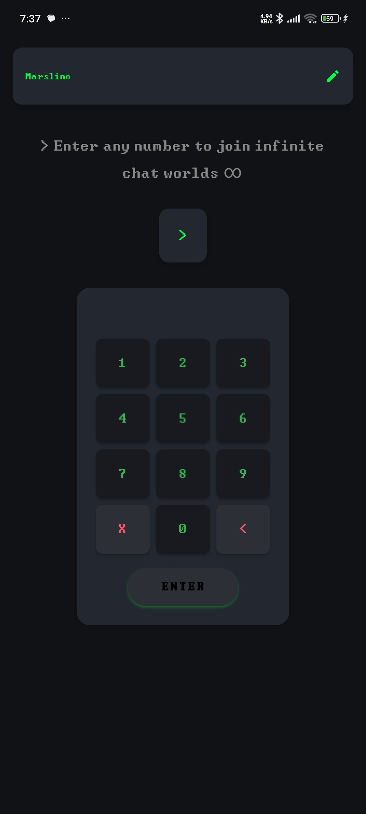
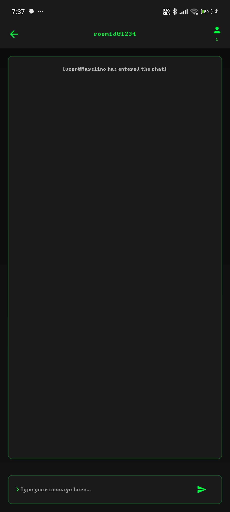
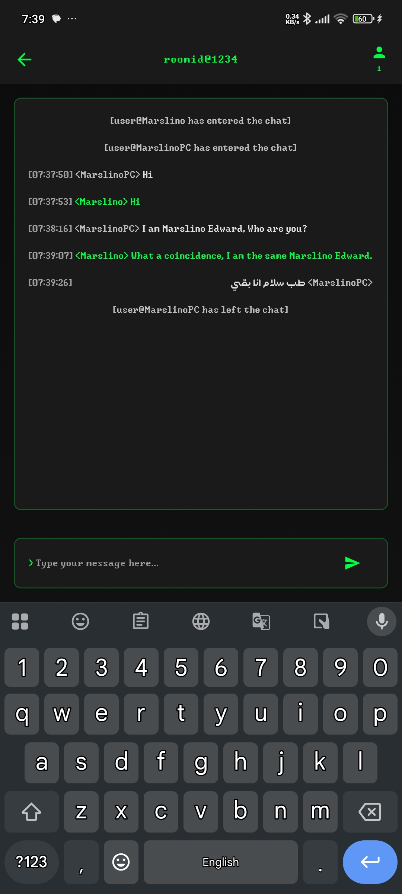

# chat\_app

chat app pased on command line theme.

<a href"https://talking-97cc3.web.app/">Try it Out</a>

<table>
  <tr>
    <td align="center">
      <b>Offline</b> 
      
    </td>
    <td align="center">
      <b>Auth</b> 
      
    </td>
  </tr>
  <tr>
    <td align="center">
      <b>EnterName</b> 
      
    </td>
    <td align="center">
      <b>Home</b> 
      
    </td>
  </tr>
  <tr>
    <td align="center">
      <b>Join</b> 
      
    </td>
    <td align="center">
      <b>Room</b> 
      
    </td>
  </tr>
  <tr>
    <td align="center">
      <b>Chat</b> 
      
    </td>
    <td></td>
  </tr>
</table>

